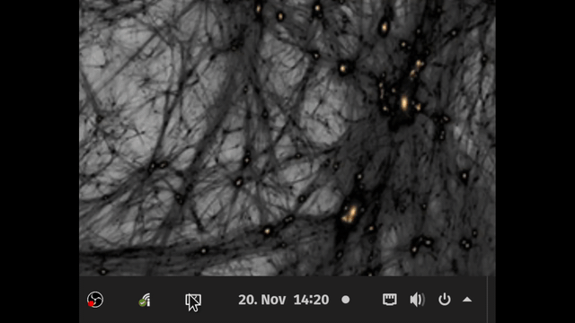

# DisplayConfig
GnomeExtension for Display Management

With this extension you can set up your display lightness on all your screens. The Game Mode deactivate all unneeded screens so you play on the primary screen.

## Setup
To run this project, unzip the Folder to:

    /home/usr/.local/share/gnome-shell/extensions/

And Name it:

    DisplayConfig

Maybe you can Install this soon from the Gnome Extension Website.

## ToDo
  - You can&#39;t do work in init()
  - You can&#39;t use GLib.spawn_command_line_sync because it will stall the thread, especially in init(). You need to use the _async versions.
  - For utf8ArrayToStr you probably want imports.byteArray.toString() which takes a Uint8Array
  - In disable() you also need to set myPopup to null to allow it to be fully cleaned up
